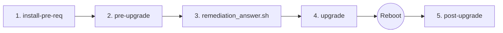

<div align="center">

# Red Hat Enterprise Linux Leapp Upgrade Manager
### Enterprise Lifecycle Automation for RHEL 7 &rarr; 8 and RHEL 8 &rarr; 9

[](https://www.redhat.com/en/technologies/linux-platforms/enterprise-linux)
[](https://www.gnu.org/software/bash/)
[](https://www.python.org/)
[](LICENSE)

<p align="center">
  <b>Safe, idempotent lifecycle wrapper around Red Hat Leapp.</b><br>
  Automates dependency setup, non-destructive risk assessments, batch inhibitor remediations, offline HTML dashboards, and post-upgrade system auditing while strictly preserving third-party packages and repositories.
</p>

[Quick Start](#-quick-start) •
[Lifecycle Phases](#-upgrade-lifecycle-phases) •
[Safety Matrix](#-production-safety-guarantee) •
[Troubleshooting](#-troubleshooting)

</div>

---

## 🛡️ Production Safety Guarantee

Running dry-runs and evaluations on live production hosts demands strict non-destructive assurance.

- **`pre-upgrade` is 100% Read-Only:** It evaluates kernels, hardware, storage, and RPM packages without installing, removing, or upgrading any packages or configuration files. Running workloads remain unaffected.
- **Benign Operational Footprint:** Only writes diagnostic logs to `/var/log/leapp/` and creates `/var/log/leapp/answerfile` if administrator decisions are required.

| Subcommand | System Impact | Modifies OS / Software? | Production Safe? |
| :--- | :--- | :---: | :---: |
| **`pre-upgrade`** | Read-Only Diagnostic Scan | ❌ No | ✅ **Yes (Live Production)** |
| **`post-upgrade`** | Read-Only Audit & Verification | ❌ No | ✅ **Yes (Live Production)** |
| **`remediation_answer.sh`** | Confirmation State File Write | ⚠️ Minor | Writes answers to `/var/log/leapp/answerfile` |
| **`install-pre-req`** | Package & Repository Setup | ⚠️ Yes | Enables target repos and installs `leapp` tools |
| **`upgrade`** | Major In-Place OS Migration | 🚨 Yes | Transactional package download (requires `UPGRADE`) |

---

## 🔄 Upgrade Lifecycle Phases

Execute each phase sequentially to ensure a clean, controlled migration:



### Phase 1: `install-pre-req`
Enables official base and migration repository channels and installs required utilities:
- **RHEL 7:** Enables `rhel-7-server-rpms`, `rhel-7-server-extras-rpms`, and installs `leapp`, `leapp-upgrade-el7toel8`, and `cockpit-leapp`.
- **RHEL 8:** Enables `BaseOS` and `AppStream` channels and installs `leapp`, `leapp-upgrade-el8toel9`, and `cockpit-leapp`.
```bash
sudo ./leapp_upgrade_manager.sh install-pre-req
```

### Phase 2: `pre-upgrade`
Performs a read-only compatibility scan to identify blocking issues before changing anything on the machine:
- Executes `leapp preupgrade` non-destructively.
- Compiles an interactive, responsive HTML dashboard (`<hostname>_Leapp_pre_upgrade_report_<timestamp>.html`) with filterable KPI metric cards and copyable command blocks.
- Generates a standalone `remediation_answer.sh` script to auto-resolve pending decision prompts.
- Recursively restores artifact folder ownership to your non-root user via `$SUDO_USER`.
```bash
sudo ./leapp_upgrade_manager.sh pre-upgrade
```

### Phase 3: Inhibitor Remediation
Applies necessary answers and mitigates discovered blockers:
- Executes batch decisions (e.g., `remove_pam_pkcs11_module_check.confirm=True`) to clear inhibitors without manual file editing.
```bash
sudo bash ./leapp_artifacts_*/remediation_answer.sh
```

### Phase 4: `upgrade`
Executes the actual transactional in-place OS migration:
- Requires interactive double-confirmation by typing `UPGRADE`.
- Automatically checks for and offers to run unapplied `remediation_answer.sh` scripts.
- Downloads target OS packages, verifies dependencies, and configures the upgrade bootloader.
```bash
sudo ./leapp_upgrade_manager.sh upgrade
```

### Phase 5: System Reboot
Reboots the host into the temporary upgrade initramfs to perform package swaps, kernel migration, and SELinux relabeling:
```bash
sudo reboot
```

### Phase 6: `post-upgrade`
Verifies system health and audits configurations after booting into the new major release:
- Audits and tabulates preserved third-party/vendor RPMs without deleting them.
- Lists leftover previous-generation packages (e.g., `.el7` RPMs on RHEL 8).
- Scans `/etc/` for unmerged `.rpmnew` and `.rpmsave` configuration templates.
- Emits actionable verification steps to re-enable SELinux enforcing mode and custom vendor repositories.
```bash
sudo ./leapp_upgrade_manager.sh post-upgrade
```

---

## 🚀 Quick Start

```bash
# 1. Clone repository & set permissions
git clone https://github.com/AkashMainali/leapp_upgrade_tool.git
cd leapp_upgrade_tool
chmod +x leapp_upgrade_manager.sh

# 2. Run prerequisites & pre-upgrade assessment
sudo ./leapp_upgrade_manager.sh install-pre-req
sudo ./leapp_upgrade_manager.sh pre-upgrade

# 3. Apply remediation answers & commit upgrade
sudo bash ./leapp_artifacts_*/remediation_answer.sh
sudo ./leapp_upgrade_manager.sh upgrade

# 4. Finalize
sudo reboot
# (After reboot)
sudo ./leapp_upgrade_manager.sh post-upgrade
```

---

## 🧭 Migration Matrix

| Current OS | Target OS | Supported Directly? | Migration Policy |
| :--- | :--- | :---: | :--- |
| **RHEL 7.9** | **RHEL 8.10** | ✅ **Yes** | In-place migration via `el7toel8` channels |
| **RHEL 8.x** | **RHEL 9.x** | ✅ **Yes** | In-place migration via `el8toel9` channels |
| **RHEL 7.x** | **RHEL 9.x** | ❌ **No** | **Two-phase migration:** RHEL 7 &rarr; 8, then RHEL 8 &rarr; 9 |

> **Guardrail:** Direct RHEL 7 &rarr; RHEL 9 attempts are automatically caught and blocked before execution.

---

## 📂 Artifacts Layout

```text
leapp_upgrade_tool/
├── leapp_upgrade_manager.sh               # Main migration script
├── leapp_artifacts_<host>_<timestamp>/    # Pre-upgrade scan directory
│   ├── <host>_Leapp_pre_upgrade_report_<timestamp>.html
│   ├── remediation_answer.sh             # Ready-to-run auto-generated answers
│   ├── answerfile                        # Snapshot of /var/log/leapp/answerfile
│   ├── leapp-report.json                 # Structured assessment findings
│   └── leapp-preupgrade.log              # Raw diagnostic actor log
└── leapp_post_artifacts_<host>_<timestamp>/ # Post-upgrade audit directory
    ├── <host>_Leapp_post_upgrade_report_<timestamp>.html
    ├── non_redhat_packages.txt           # Inventory of preserved third-party RPMs
    ├── third_party_and_legacy_rpms.txt   # Leftover packages from prior release
    └── configuration_rpmnew_rpmsave.txt  # Audit list of configuration files
```

---

## 🔍 Troubleshooting

<details>
<summary><b>1. Target Repositories Not Found / Missing GPG Keys</b></summary>
<br>

**Cause:** System is pinned to an older release (e.g. `7.9` or `7Server`), preventing Subscription Manager from discovering RHEL 8 channels.
```bash
sudo subscription-manager release --unset
sudo subscription-manager refresh
sudo yum clean all
sudo subscription-manager release --list
```
*(For disconnected/Satellite networks, provide local repos and execute with `leapp preupgrade --no-rhsm`.)*
</details>

<details>
<summary><b>2. Missing Required Answers in Answer File</b></summary>
<br>

**Cause:** Undefined choice in `/var/log/leapp/answerfile` (commonly `remove_pam_pkcs11_module_check`).
```bash
sudo bash ./leapp_artifacts_*/remediation_answer.sh
```
</details>

<details>
<summary><b>3. Running Kernel Mismatch</b></summary>
<br>

**Cause:** The booted kernel does not match the latest installed kernel package.
```bash
sudo reboot
# After reboot verify match:
uname -r && rpm -q --last kernel | head -n1
```
</details>

---

## 📄 License

Licensed under the [MIT License](LICENSE).
