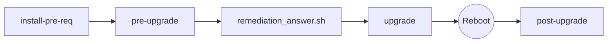

<div align="center">

# Red Hat Enterprise Linux Leapp Upgrade Manager
### Enterprise-grade, automated lifecycle migration tool for RHEL 7 &rarr; 8 and RHEL 8 &rarr; 9

[](https://www.redhat.com/en/technologies/linux-platforms/enterprise-linux)
[](https://www.gnu.org/software/bash/)
[](https://www.python.org/)
[](LICENSE)
[]()

<p align="center">
  <b>Safe, idempotent, and production-ready automation wrapper around Red Hat Leapp.</b><br>
  Features interactive CLI validation, automated dependency management, dynamic inhibitor remediation generation, rich executive HTML dashboard reporting, and post-upgrade configuration auditing.
</p>

[Quick Start](#-quick-start) •
[Architecture](#-architecture--workflow) •
[Key Features](#-core-features) •
[Reporting Dashboards](#-interactive-reporting-dashboards) •
[Troubleshooting](#-troubleshooting)

</div>

---

## 📌 Overview

Upgrading Enterprise Linux across major release boundaries is high-risk. Unresolved kernel blockers, deprecated authentication plugins, missed answerfile confirmations, and repository mapping discrepancies routinely break migrations mid-stream.

**Leapp Upgrade Manager** wraps the standard `leapp` utility in an end-to-end operational framework:
- **Prevents illegal version leaps** (e.g., stops users from attempting an unsupported RHEL 7 &rarr; RHEL 9 jump).
- **Auto-generates remediation scripts** by extracting unanswered dialog questions and inhibitor commands directly from assessment data.
- **Delivers interactive HTML5 dashboards** with metrics cards, real-time search, and copy-paste remediation commands.
- **Protects third-party software** by maintaining non-Red Hat RPMs, libraries, and custom repo definitions throughout and after migration.
- **Resolves environment friction** via automatic runtime discovery (`python3`, `python2`, `/usr/libexec/platform-python`) and user permission restoration (`chown` back to invoking user).

---

## 🚀 Quick Start

### 1. Clone & Permissions
```bash
git clone https://github.com/AkashMainali/leapp_upgrade_tool.git
cd leapp_upgrade_tool
chmod +x leapp_upgrade_manager.sh
```

### 2. Full Upgrade Lifecycle



```bash
# Step 1: Install Leapp migration packages and repository channels
sudo ./leapp_upgrade_manager.sh install-pre-req

# Step 2: Run dry-run checks and produce the interactive HTML assessment
sudo ./leapp_upgrade_manager.sh pre-upgrade

# Step 3: Clear any inhibitors using the automatically compiled script
sudo bash ./leapp_artifacts_*/remediation_answer.sh

# Step 4: Run the actual upgrade transaction (double-confirmation required)
sudo ./leapp_upgrade_manager.sh upgrade

# Step 5: Reboot into the target OS initramfs to finalize installation
sudo reboot

# Step 6: Verify system state, third-party packages, and config merges
sudo ./leapp_upgrade_manager.sh post-upgrade
```

---

## 🧭 Migration Matrix

| Current OS | Target OS | Supported Directly? | Upgrade Strategy |
| :--- | :--- | :---: | :--- |
| **RHEL 7.9** | **RHEL 8.10** | ✅ **Yes** | Standard migration using `el7toel8` channels |
| **RHEL 8.x** | **RHEL 9.x** | ✅ **Yes** | Standard migration using `el8toel9` channels |
| **RHEL 7.x** | **RHEL 9.x** | ❌ **No** | **Two-phase migration:** RHEL 7 &rarr; RHEL 8, then RHEL 8 &rarr; RHEL 9 |

> **Guardrail Enforced:** If a user attempts to run the script on RHEL 7 targeting RHEL 9, the script exits immediately with an actionable error.

---

## ⚡ Core Features

### 1. Dynamic Inhibitor Remediation Engine
Leapp frequently halts migrations with `Missing required answers in the answer file` (most commonly `remove_pam_pkcs11_module_check`). This tool:
1. Automatically parses `/var/log/leapp/answerfile` and `/var/log/leapp/leapp-report.json`.
2. Compiles a custom executable script: `leapp_artifacts_<hostname>_<timestamp>/remediation_answer.sh`.
3. Auto-detects this script during the `upgrade` phase and prompts to execute answers with zero manual editing required.

### 2. Enterprise Reporting Dashboards
Generates standalone, CSS-inlined, responsive HTML dashboards that work completely offline:
- **Executive Summary:** Hostname (FQDN), date/time, and migration path badges.
- **KPI Metrics Tiles:** One-click filtering by severity (Inhibitors, High Risk, Medium, Low, Info).
- **Interactive Search:** Real-time client-side filter by keyword, package name, or command.
- **Code Terminal Cards:** Cleanly formatted bash commands with built-in clipboard copying.

### 3. Non-Destructive Post-Upgrade Audit
Official migration guides often suggest deleting non-Red Hat RPMs. This tool defaults to **zero software deletion**:
- Inventories and tabulates all preserved third-party / vendor packages.
- Identifies leftover `.el7` or `.el8` distribution RPMs.
- Locates unmerged `/etc/*.rpmnew` and `/etc/*.rpmsave` files.
- Provides commands to restore SELinux to `enforcing` and re-enable custom yum repositories.

### 4. Non-Root File Ownership
Scripts run under `sudo` typically leave generated reports locked to `root:root`. This framework captures `$SUDO_USER` and automatically performs a recursive `chown` back to the invoking user and primary group.

---

## 📂 Artifacts Directory Layout

Each assessment and audit run archives logs and reports cleanly alongside the script:

```text
leapp_upgrade_tool/
├── leapp_upgrade_manager.sh               # Main executable manager script
│
├── leapp_artifacts_<host>_<timestamp>/    # Pre-upgrade outputs
│   ├── <host>_Leapp_pre_upgrade_report_<timestamp>.html
│   ├── remediation_answer.sh             # Ready-to-run auto-generated answers
│   ├── answerfile                        # Snapshot of /var/log/leapp/answerfile
│   ├── leapp-report.json                 # Structured assessment data
│   ├── leapp-report.txt                  # Full human-readable report
│   └── leapp-preupgrade.log              # Raw diagnostic actor log
│
└── leapp_post_artifacts_<host>_<timestamp>/ # Post-upgrade outputs
    ├── <host>_Leapp_post_upgrade_report_<timestamp>.html
    ├── non_redhat_packages.txt           # Inventory of preserved third-party RPMs
    ├── third_party_and_legacy_rpms.txt   # Leftover packages from prior major release
    ├── repositories_status.txt           # YUM/DNF repository status map
    ├── configuration_rpmnew_rpmsave.txt  # Audit list of configuration merges
    └── leapp-upgrade.log                 # Upgrade transaction execution log
```

---

## 🛠 Command Reference

```text
Usage: ./leapp_upgrade_manager.sh {install-pre-req|pre-upgrade|upgrade|post-upgrade}

Subcommands:
  install-pre-req  Enables official RHEL repositories and installs leapp packages
  pre-upgrade      Executes pre-flight inspection, generates HTML report & remediation script
  upgrade          Runs the in-place package migration (requires typing 'UPGRADE')
  post-upgrade     Performs post-reboot health check, inventory, and configuration audit
```

---

## 🔍 Troubleshooting & Known Inhibitors

<details>
<summary><b>1. Cannot find required basic RHEL target repositories / Missing GPG Keys</b></summary>
<br>

**Symptoms:**
```text
Actor: missing_gpg_keys_inhibitor
Message: Could not check for valid GPG keys
Inhibitor: Cannot find required basic RHEL target repositories.
```

**Resolution:**
The system is locked to an older minor release (such as `7.9` or `7Server`), preventing Subscription Manager from discovering RHEL 8 channels. Run:
```bash
sudo subscription-manager release --unset
sudo subscription-manager refresh
sudo yum clean all
sudo subscription-manager release --list
```
*If operating in an air-gapped lab or Satellite setup without RHSM, supply local repos and execute with `leapp preupgrade --no-rhsm`.*
</details>

<details>
<summary><b>2. Missing required answers in the answer file</b></summary>
<br>

**Symptoms:**
```text
Inhibitor: Missing required answers in the answer file
Section: remove_pam_pkcs11_module_check.confirm
```

**Resolution:**
Run the remediation script generated by this tool:
```bash
sudo bash ./leapp_artifacts_*/remediation_answer.sh
```
Or execute directly via the CLI:
```bash
sudo leapp answer --section remove_pam_pkcs11_module_check.confirm=True
```
</details>

<details>
<summary><b>3. Booted kernel does not match newest installed kernel</b></summary>
<br>

**Symptoms:**
```text
Inhibitor: Newest installed kernel not in use
```

**Resolution:**
Reboot the machine into the newest installed kernel, confirm with `uname -r`, and re-run `pre-upgrade`:
```bash
sudo reboot
```
</details>

---

## 🛡 Security & Safety Guardrails

- **Mandatory Root Elevation:** Checks for `$EUID -eq 0` before any phase begins.
- **Double Confirmation:** Upgrade execution requires typing uppercase `UPGRADE` to prevent accidental commits.
- **Permissive Exit Codes:** Handles non-zero return codes from `leapp preupgrade` gracefully so reports compile even when inhibitors are detected.
- **Safe HTML Escaping:** Sanitizes finding summaries and titles to prevent malformed rendering across both Python 2.7 and Python 3 engines.

---

## 📄 License

This project is licensed under the [MIT License](LICENSE).
